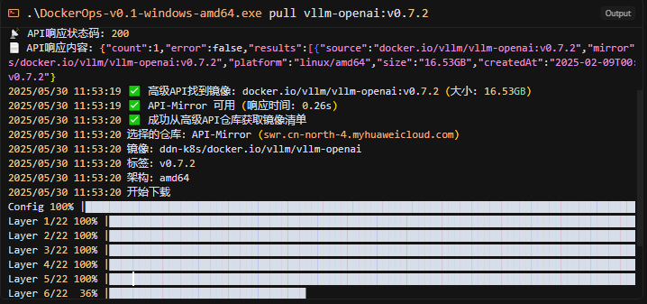

# DockerOps

[](https://golang.org)
[](LICENSE)
[](https://github.com/yourusername/DockerOps/releases)

DockerOps 是一个增强版的 Docker 镜像拉取工具，专为解决国内 Docker 镜像拉取困难而设计。支持多镜像仓库搜索、自动故障转移、并发下载等功能。

## 🎬 演示效果



*DockerOps 成功拉取大型镜像 (vllm-openai:v0.7.2, 16.53GB)，实时进度显示和高速下载*

## ✨ 特性

- 🚀 **多镜像仓库支持** - 支持阿里云、腾讯云、华为云等多个国内镜像仓库
- 🔄 **自动故障转移** - 当一个仓库不可用时自动切换到下一个
- ⚡ **并发下载** - 支持多线程并发下载，提升下载速度
- 📊 **进度条显示** - 实时显示下载进度
- 🔧 **配置文件管理** - 通过 JSON 配置文件管理镜像仓库
- 🏷️ **标签转换规则** - 智能标签转换和映射
- 🌐 **跨平台支持** - 支持 Windows、Linux、macOS
- 🔍 **镜像搜索** - 支持在多个仓库中搜索镜像
- 📦 **镜像管理** - 支持镜像推送、加载、保存等操作

## 🛠️ 安装

### 从源码编译

```bash
# 克隆仓库
git clone https://github.com/caapap/DockerOps.git
cd DockerOps

# 编译
go build -o dockerops main.go

# 或使用构建脚本
# Windows
./build.bat

# Linux/macOS
./build.sh
```

### 预编译二进制文件

从 [Releases](https://github.com/caapap/DockerOps/releases) 页面下载对应平台的预编译二进制文件。

## 📖 使用方法

### 基本用法

```bash
# 拉取镜像
./dockerops pull nginx:latest

# 指定架构
./dockerops pull --arch linux/amd64 nginx:latest

# 静默模式
./dockerops pull --quiet nginx:latest

# 调试模式
./dockerops pull --debug nginx:latest
```

### 高级用法

```bash
# 使用自定义配置文件
./dockerops pull --config custom-config.json nginx:latest

# 指定用户名和密码（用于私有仓库）
./dockerops pull --username myuser --password mypass private/image:tag

# 添加前缀
./dockerops pull --prefix myregistry.com/ nginx:latest
```

### 其他命令

```bash
# 查看版本
./dockerops version

# 查看帮助
./dockerops help

# 查看特定命令帮助
./dockerops pull --help
```

## ⚙️ 配置

DockerOps 使用 `config.json` 文件来管理镜像仓库配置。默认配置包含以下仓库：

- 阿里云容器镜像服务
- 腾讯云容器镜像服务  
- 华为云容器镜像服务
- 其他公共镜像仓库

### 配置文件格式

```json
{
  "registries": [
    {
      "name": "阿里云",
      "url": "registry.cn-hangzhou.aliyuncs.com",
      "priority": 1,
      "auth_required": false,
      "timeout": 15,
      "description": "阿里云容器镜像服务"
    }
  ]
}
```

### 配置字段说明

- `name`: 仓库名称
- `url`: 仓库地址
- `priority`: 优先级（数字越小优先级越高）
- `auth_required`: 是否需要认证
- `timeout`: 超时时间（秒）
- `description`: 仓库描述

## 🔌 API 参考

DockerOps 还提供了公共 API 接口，详细信息请参考 [API 文档](api/refer.md)。

主要 API 端点：

- `GET /api/v1/latest` - 获取最新同步
- `GET /api/v1/image?search=<镜像名>` - 搜索镜像
- `GET /api/v1/health` - 健康检查

## 🏗️ 项目结构

```
DockerOps/
├── cmd/                    # 命令行接口
│   └── root.go            # 根命令和子命令定义
├── internal/              # 内部包
│   ├── config/           # 配置管理
│   └── puller/           # 镜像拉取逻辑
├── api/                   # API 文档
│   └── refer.md          # API 参考文档
├── build/                 # 构建输出目录
├── .github/              # GitHub Actions 工作流
├── config.json           # 默认配置文件
├── build.bat             # Windows 构建脚本
├── build.sh              # Linux/macOS 构建脚本
├── main.go               # 程序入口
├── go.mod                # Go 模块文件
├── go.sum                # Go 依赖校验文件
├── LICENSE               # 许可证文件
└── README.md             # 项目说明文档
```

## 🤝 贡献

欢迎贡献代码！请遵循以下步骤：

1. Fork 本仓库
2. 创建特性分支 (`git checkout -b feature/AmazingFeature`)
3. 提交更改 (`git commit -m 'Add some AmazingFeature'`)
4. 推送到分支 (`git push origin feature/AmazingFeature`)
5. 开启 Pull Request

## 📝 许可证

本项目采用 MIT 许可证 - 查看 [LICENSE](LICENSE) 文件了解详情。

## 🙏 致谢

- [Cobra](https://github.com/spf13/cobra) - 强大的 CLI 库
- [ProgressBar](https://github.com/schollz/progressbar) - 进度条显示
- 各大云服务商提供的镜像仓库服务

## 📞 联系方式

如有问题或建议，请通过以下方式联系：

- 提交 [Issue](https://github.com/caapap/DockerOps/issues)
- 发送邮件到：caapap@qq.com

---

⭐ 如果这个项目对你有帮助，请给它一个星标！ 